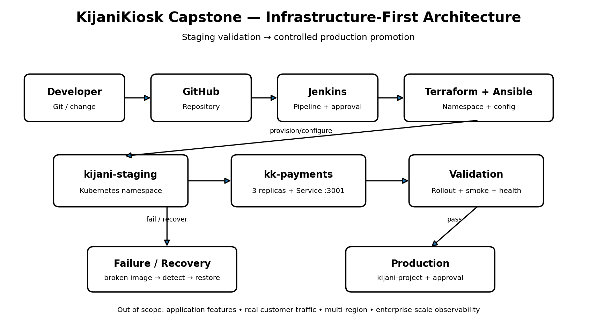

# KijaniKiosk Capstone

## Overview

KijaniKiosk is a DevOps capstone demonstrating a controlled staging-to-production Kubernetes delivery workflow for the `kk-payments` application.

The project extends an existing Kubernetes deployment with infrastructure as code, configuration management, automated staging validation, failure testing, monitoring, and an explicit production approval gate.

## Architecture



## Delivery Workflow

```text
Code Change
    |
    v
Jenkins
    |
    v
Deploy to Staging
    |
    v
Rollout Validation
    |
    v
Smoke Test
    |
    v
Human Approval
    |
    v
Deploy to Production
    |
    v
Production Rollout
